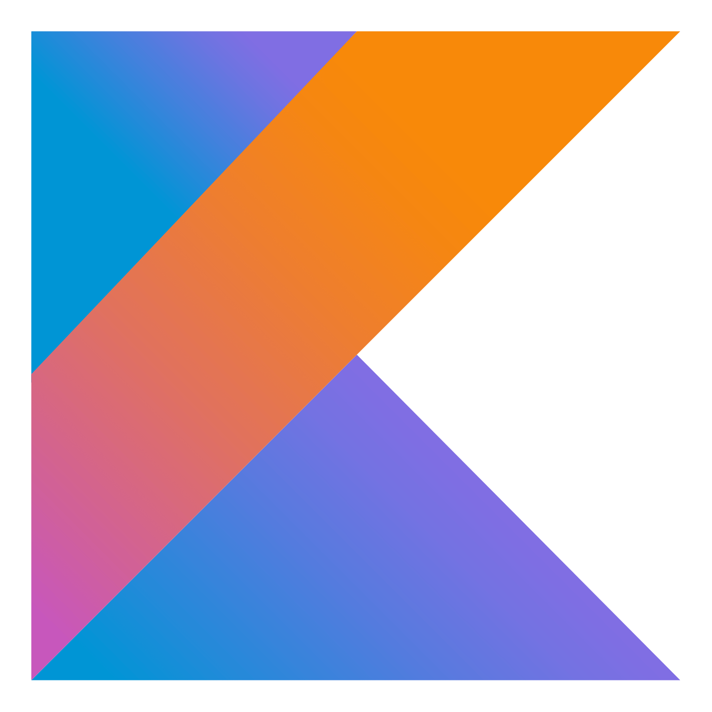
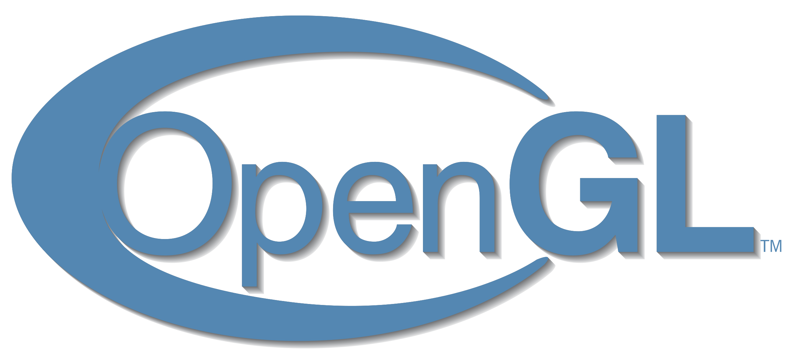
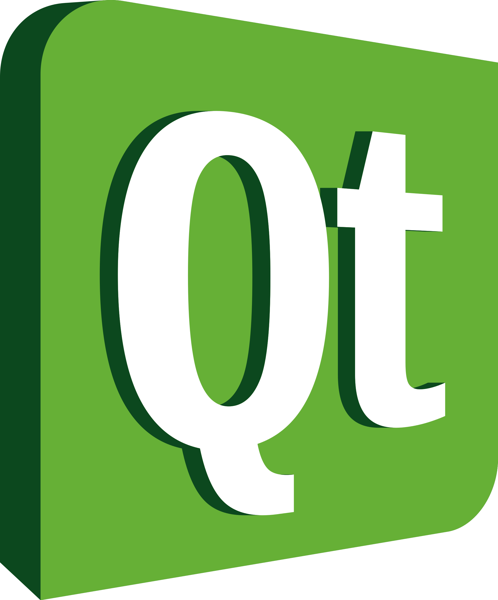
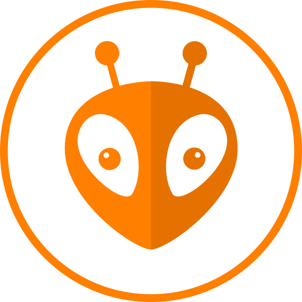
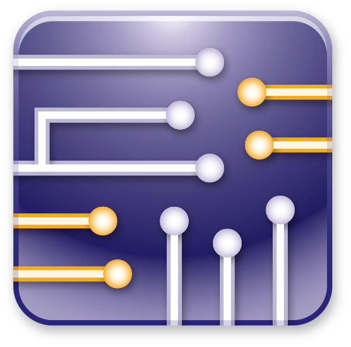
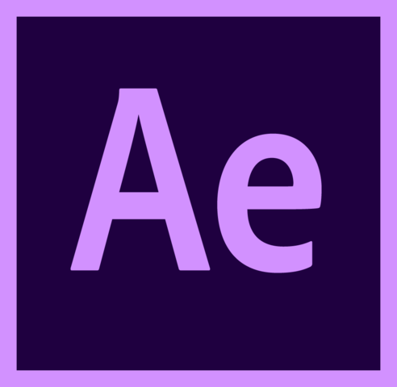

# Hi there! 

##  About Me:
<pre>
 ‍💻 Software and hardware engineer
 🎯 I primarily develop desktop applications and embedded system applications
 🌌 Web Applications, Game Development, Graphic Design
 🎓 Tomas Bata University - Faculty of Applied Informatics
 💻 Most used languages <b>C++</b>, <b>C</b>, <b>JAVA</b>
 
 <b>Hobby:</b>
 🛩️ Drones & planes
 🛴 Electric scooters
 🤖 Robots
 🍣 Sushi
</pre>
---

## Skills 
### 👉 Programming languages

       
      &emsp;
       
      &emsp;
       
      &emsp;
      
      &emsp;
      
      &emsp;
       
      &emsp;
       
      &emsp;
       
</p4>

### 👉 Frameworks & Technology

       
      &emsp;
       
      &emsp;
       
      &emsp;
       
      &emsp;
       
      &emsp;
       

### 👉 IDEs & Tools

       
      &emsp;
       
      &emsp;
       
      &emsp;
       
      &emsp;
       
      &emsp;
       

### 👉 Game Development & Graphic Design

       
      &emsp;
       
      &emsp;
       
      &emsp;
       
      &emsp;
       
      &emsp;

---

## 📊 Github Stats

   

	
	 

	

