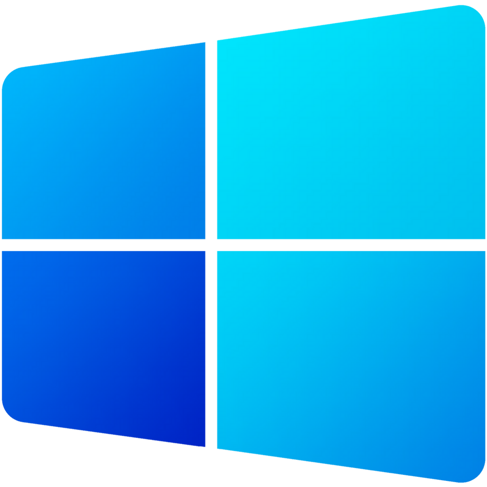

# Hi there! 

##  About Me:
- ‍I'm a backend developer and hardware engineer
- 🎓 Tomas Bata University - Faculty of Applied Informatics
- 💻 I use daily **C++**, **C**, **JAVA**

## Skills 
### 👉 Programming languages

       
      &emsp;
       
      &emsp;
       
      &emsp;
       
      &emsp;
       
      &emsp;
       

### 👉 Frameworks & Technology

       
      &emsp;
       
      &emsp;
       
      &emsp;
       
      &emsp;
       
      &emsp;
       

### 👉 Software & Tools

       
      &emsp;
       
      &emsp;
       
      &emsp;
       
      &emsp;
       
      &emsp;
       

### 👉 Operating Systems

       
      &emsp;
       
      &emsp;
       

---

## 📊 Github Stats

