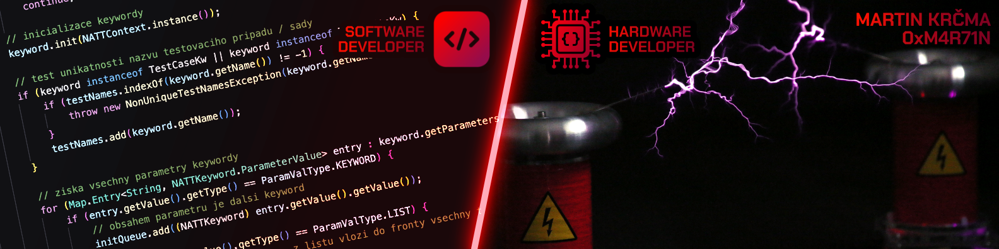

<div align="center">
	
	<a href="https://github.com/0xMartin">
		
	</a>
</div>

<h1 style="border-bottom: none;">
	 About Me
</h1>


Hello! I'm a passionate **software and hardware engineer** with a deep curiosity for how things work, both in technology and the world around us. My journey in tech began early and has been driven by a genuine enjoyment for exploring and learning every day. I love transforming ideas into tangible projects.

**🎯 What I doing:** `Desktop App Development` `Embedded App Development` `Circuit/PCB Design` `Game Development` `AI Development` `Backend App Development`
 
**🎓 Education:** Tomas Bata University - Faculty of Applied Informatics
 
**💻 My favorite languages: ` C++ `, ` Java `, ` Lua `**
 
**Hobby:**
 `🛩️ Drones & planes`
 `🛴 Electric scooters`
 `🤖 Robots`
 `📷 Photographing`
 `🍣 Sushi`
 `💻 Games`
 `🃏 Poker`
 `🎆 Pyrotechnics`
 `🏊 Swimming`
 
<h1 style="border-bottom: none;">
	 
	My Tech Stack
</h1>

<div>
	<h3>💻 Programming Languages</h3>
	
	
	
	
	
	
	
</div>

<div>
	<h3>🌐 Frameworks & Technologies</h3>
	
	
	
	
	
	
	
	
	
	
	
	
	
	
	
	
	
	
	
	
</div>

<div>
    <h3>🛠️ IDEs & Tools</h3>
    
    
    
    
    
    
    
    
</div>

<div>
	<h3>🎮🎨 Game Development & Graphic Design</h3>
	
	
	
	
	
</div>

---

<h1 style="border-bottom: none;">
	📊 My Stats
</h1>

<!--START_SECTION:waka-->

```rust
From: 30 May 2023 - To: 05 August 2025

Total Time: 287 hrs 18 mins

C++                181 hrs 44 mins >>>>>>>>>>>>>>>>---------   62.11 %
Python             70 hrs 46 mins  >>>>>>-------------------   24.19 %
C                  6 hrs 45 mins   >------------------------   02.31 %
CMake              6 hrs 8 mins    >------------------------   02.10 %
Other              5 hrs 18 mins   -------------------------   01.81 %
```

<!--END_SECTION:waka-->
